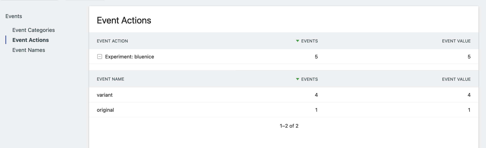

# Matomo Simple A/B Testing Plugin

## Description

Simple A/B Testing is a plugin for Matomo to do A/B testing experiments through Matomo.

## Dependencies

The plugin depends on Matomo Tag Manager, as the experiments are added as a Tag in Matomo Tag Manager.

## Events

The plugin sends events to Matomo:

- Event category: "SimpleABTesting".
- Event action: Experiment: NAME_OF_EXPERIMENT.
- Event names: original or variant (the experiment).
- Event value: 1 (same for original and variant).

## Adding a new experiment

1. From Dashboard -> Simple A/B Testing -> Create a new experiment.
2. Set a name for the experiment.
3. Insert custom CSS or JS for the variant.

## Activate the experiment

1. In your Matomo Tag Manager container, create a new tag - choose "Simple A/B Testing".
2. Set a name for the tag
3. Add description (optional)
4. At "Configure what this tag should do", choose the the experiment you want to add.
5. At "Configure when the tag should do this", choose a trigger (Pageview works fine).
6. Click "Create new tag"
7. Publish the change of your container.
8. Test it!

## Reports

We are still working on for getting reports into the plugin. For now, you could get some clue what is going on while checking into events.

## Cookie

The plugin sets a cookie prefixed with the "sabt_" and then the experiment name. If the experiment is named "redbutton", the cookie will be named `sabt_redbutton`. The cookie lives until the end of the experiment.

## API

You can add and delete experiments with Matomo API.

- `SimpleABTesting.insertExperiment` (idSite, name, hypothesis, description, fromDate, toDate, cssInsert, customJs)
- `SimpleABTesting.deleteExperiment` (id)

## GDPR and personally identifiable information

Out of the box, this plugin does not store any personal information. With that said, with using JavaScript within an experiment, personal data could be stored somewhere else.

## Fork

This is a fork of the original [Simple A/B testing-plugin](https://github.com/nofrillsplugins/matomo-simple-ab-testing).
